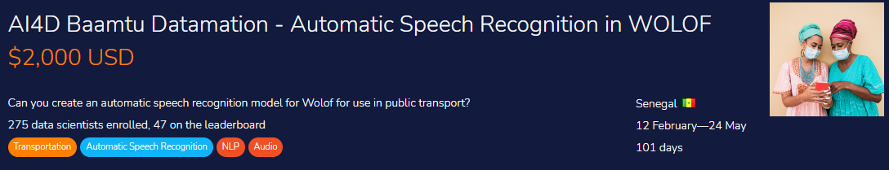
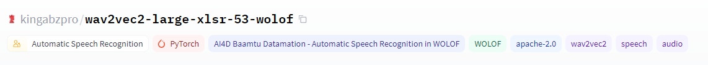
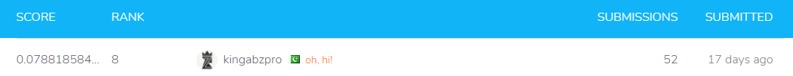

# WOLOF-ASR-Wav2Vec2
 Audio preprocessing and finetuning using wav2vec2-large-xlsr model on AI4D Baamtu Datamation - automatic speech recognition in WOLOF data.

## Zindi ASR Competition 

The challenge will focus on a public transport use case for two reasons. First, many users of public transport can’t read or speak French, so they can’t interact with existing apps that help passengers to find a bus for a given destination. And second, there is already an existing app in Senegal, [WeeGo](https://www.weegolines.com/), which helps passengers to get transport information.

The goal of this competition is to build an ASR model that will help illiterate people use existing apps to find which bus they can take to reach their destination, without having to know how to read or write.

**About Baamtu Datamation (**[**baamtu.com**](https://baamtu.com/)**)**

Baamtu Datamation is a Senegalese company focused on helping companies to leverage AI and Big Data.

**About AI4D-Africa; Artificial Intelligence for Development-Africa Network (**[**ai4d.ai**](https://ai4d.ai/)**)**

## WOLOF Speech Data

The Zindi data is easily accessible if you have Zindia account. **I don't have permission to publish the data in repos due to their updates in terms and conditions.**

There are 6683 audio files in the train set and 1590 in the test set. You will use these files to train your model and submit your translations.

The goal of this competition is to build an ASR model that will help illiterate people use existing apps to find which bus they can take to reach their destination, without having to know how to read or write.

**Files available for download:**

- **clips.zip** - contains all the audio files
- **Train.csv** - contains the audio IDs and the transcription. This is the dataset that you will use to train your model.
- **Test.csv** - contains the audio IDs and some information about the audio file. It does not include the transcription. You will use the model you trained on Train.csv to make your translation predictions for the test files.
- **SampleSubmission.csv** - shows the submission format for this competition, with the ID column indicating the test audio files. The “transcription” column contains your predictions. The order of the rows does not matter, but the names of the ID must be correct.

## Preprocessing `.mp3` to`.wav` file format.

The audio data that was given to us was in`.mp3` format and we have to downs ample and convert it into `.wav` format in order to finetune `facebook/wav2vec2-large-xlsr-53` model. 

_I have used **Joblib** Parallel to reduce the conversion time._

### Reference

Idea is from this notebook :[Kaggle]( https://www.kaggle.com/raghaw/panda-medium-resolution-dataset-25x256x256)

Joblib Parallel form : [YouTube](https://www.youtube.com/watch?v=Ny3O4VpACkc&list=PL98nY_tJQXZnoCDfHLo58tRHUyNvrRVzn&index=4)

## Removing silence and noise from Audio files.

The main function was inspired by [Remove Background/Dead Noise](https://www.kaggle.com/jainarindam/imp-remove-background-dead-noise), where he have used simple audio library to remove both noise and silence. Then I used `Joblib` to increase the processing power. All the files were then zipped and ready to be used in both **Kaggle** and **Colab** for performance enhancement. 

## Finetuning and Predictions.

I have used competition data and converted pandas dataset into transformer data set for data preprocessing. I have explained everything in notebook. you can also play around will model parameters to improve the performance. 

**Most of the code was inspired by [fine-tune-xlsr-wav2vec2](https://huggingface.co/blog/fine-tune-xlsr-wav2vec2)**

## Model Available 

You can download my model from hugging face and use it directly to produce similar results. I have also added my best submission file in `.cvs` so that you can test it on competition page. 

Repo Image Credit: [miro](https://miro.medium.com/max/700/0*yiRqJ9RcZ9suWOFK.jpg)

## Results

You can check my result on [Zindi](https://zindi.africa/competitions/ai4d-baamtu-datamation-automatic-speech-recognition-in-wolof/leaderboard), I got 8th rank in AI4D Baamtu Datamation - Automatic Speech Recognition in WOLOF

**Result**: 7.88 %

